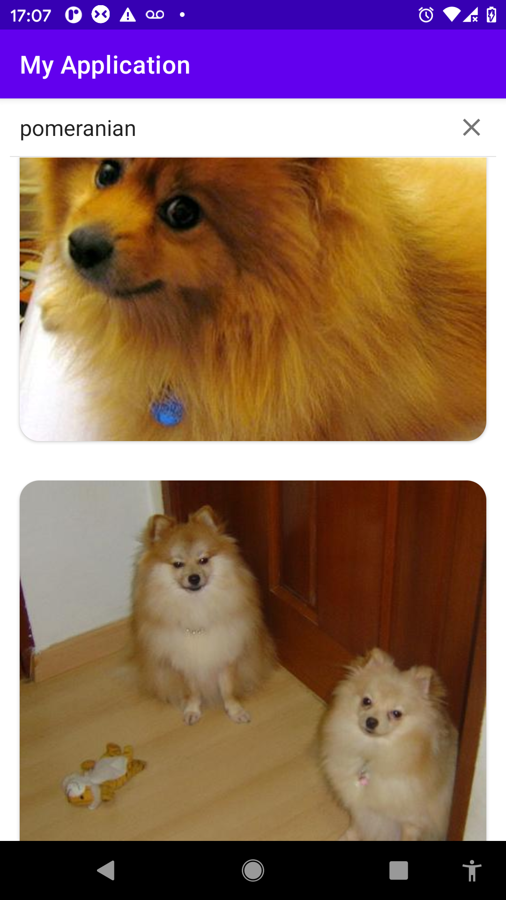

# kotlin-retrofit-coroutines
This app retrieves data from a Dog API using Retrofit

## Images

---

## Resources:books:

* [Tutorial Retrofit]("https://www.youtube.com/watch?v=aQP-mUGWh1U&t=930s")

